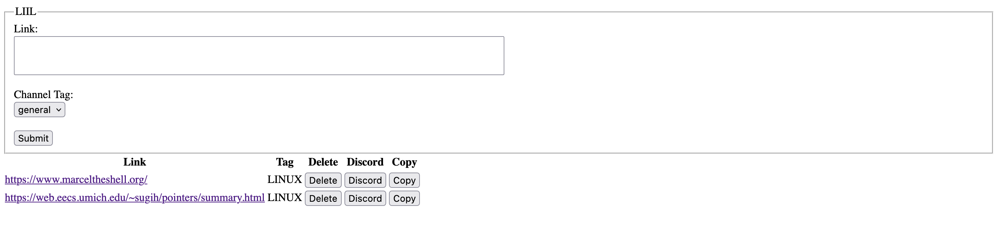

# LIIL

Look Into It Later - A link storing utility to refer the links I'm interested to read
or store later.

I use,

Project structure inspriations,

* https://github.com/jerry-git/pytest-split?ref=blog.jerrycodes.com
* https://github.com/samuelcolvin/aicli

